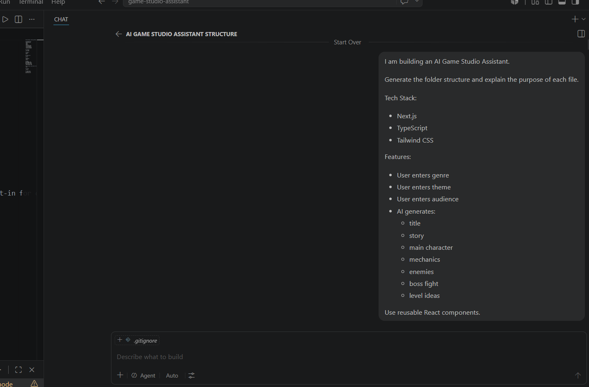
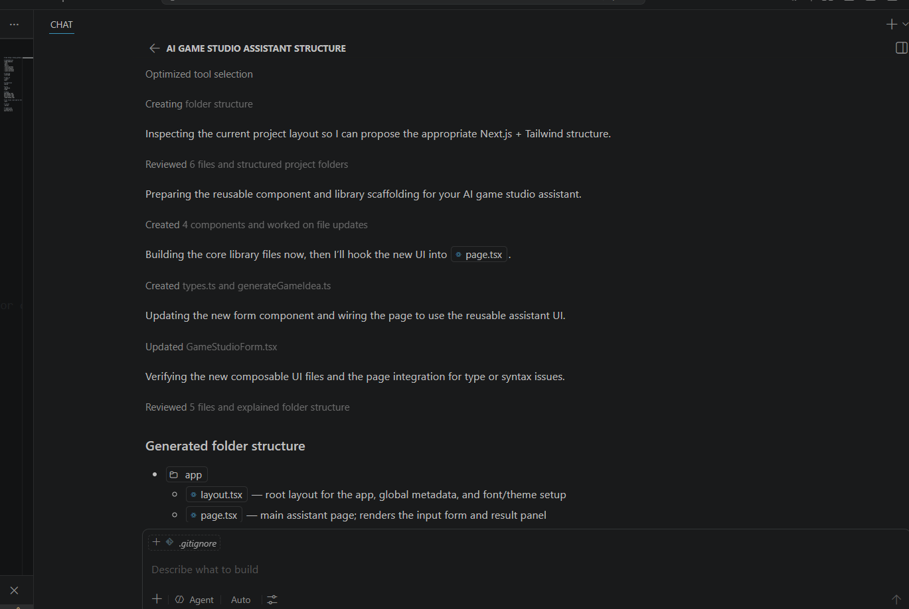
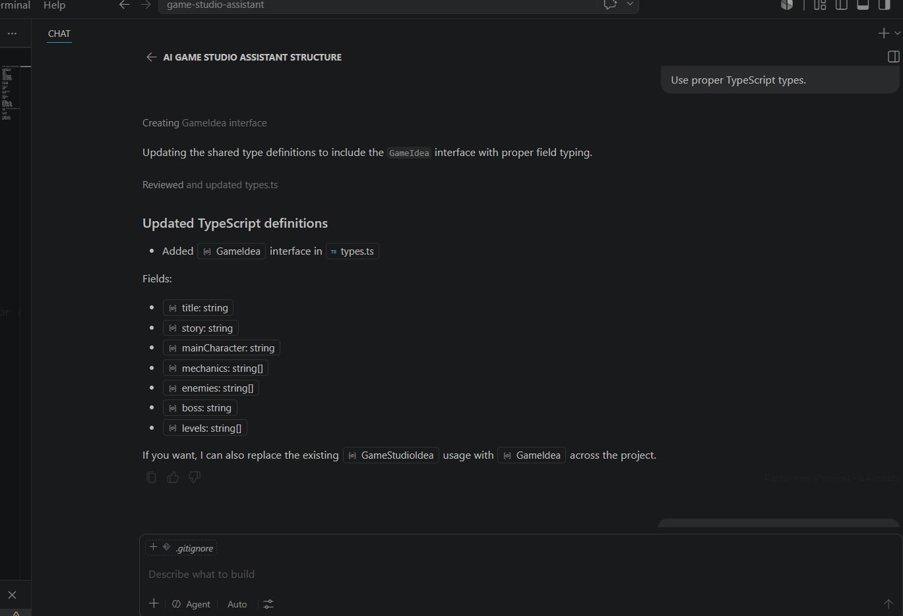
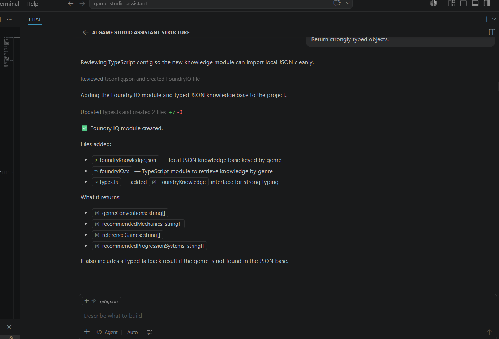
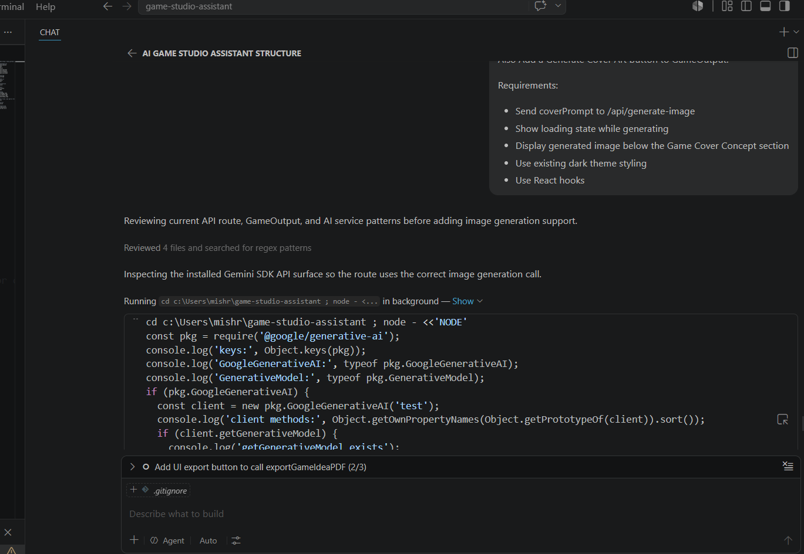
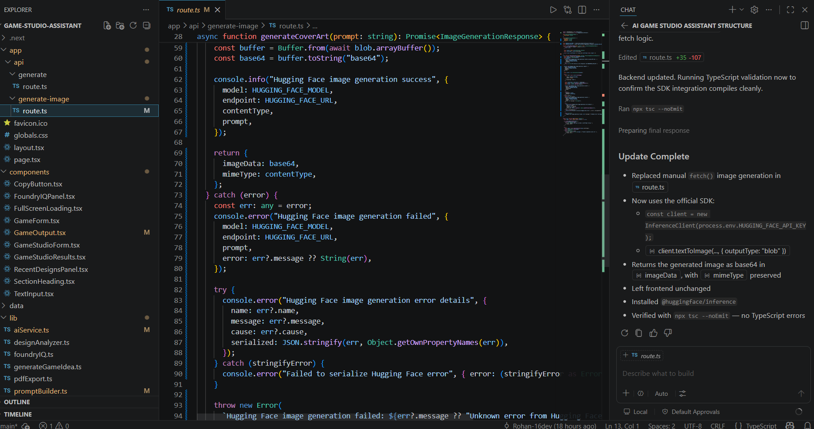
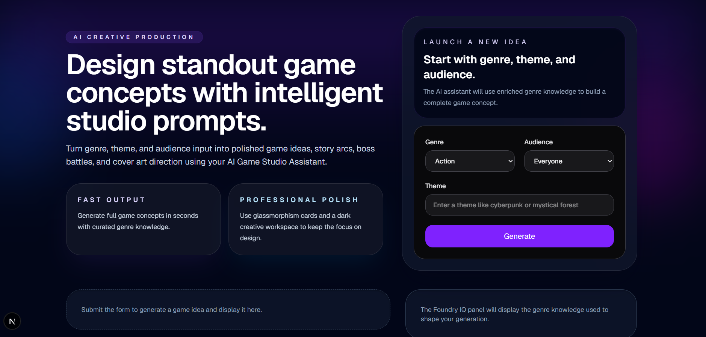
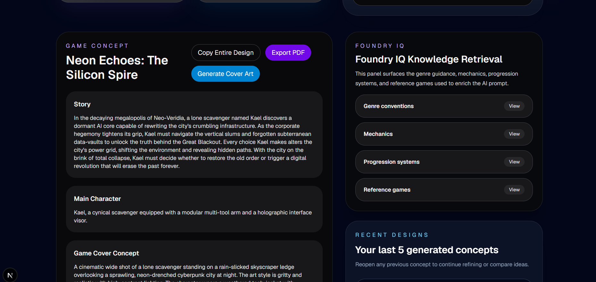
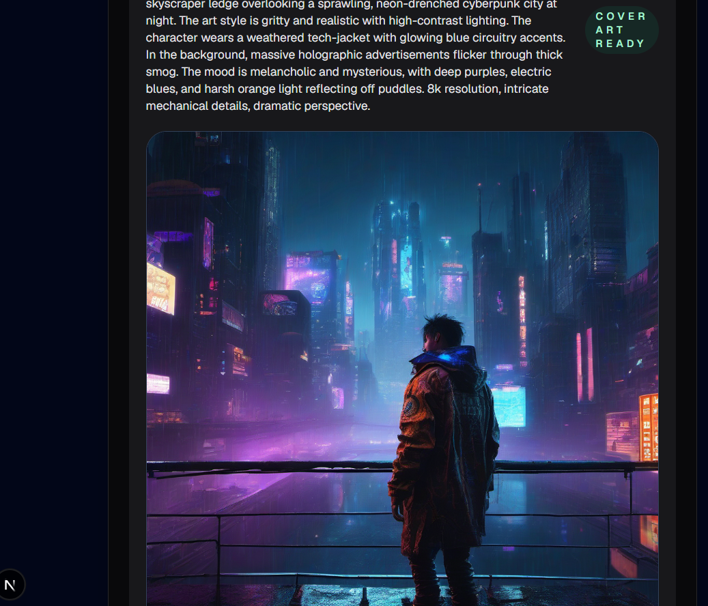
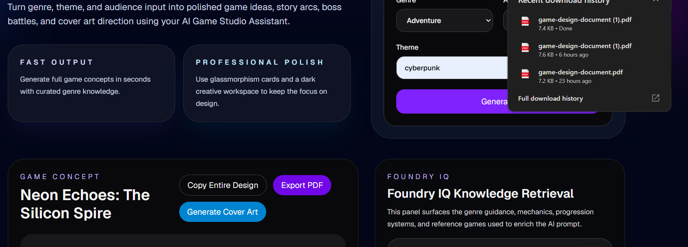

# 🎮 AI Game Studio Assistant

An AI-powered game design assistant built for Agents League Hackathon.

The application helps aspiring game developers rapidly generate complete game concepts, design documents, gameplay systems, character ideas, level concepts, and cover art from a simple prompt.

It combines AI generation, a Foundry IQ-inspired knowledge retrieval layer, image generation, and PDF export capabilities into a single workflow.

---

## 🚀 Live Demo

**Deployment:** [https://ai-game-studio-assistant.vercel.app]

---

# 🎥 Demo Video


[Watch Demo Video](https://youtu.be/Qnt04kTTs5M?si=pY8QXkvqvBaz5d5I)

The demo showcases:

- Game concept generation
- Foundry IQ knowledge retrieval
- Prompt enrichment workflow
- AI-generated cover art
- PDF export functionality

---

## 📌 Problem Statement

Indie developers and students often struggle during the early stages of game development:

- Generating unique game concepts
- Designing gameplay systems
- Creating coherent worlds and characters
- Maintaining genre consistency
- Producing professional documentation

This project accelerates ideation by generating structured Game Design Documents (GDDs) enriched with genre-specific knowledge.

---

# ✨ Features

### 🎯 Game Concept Generation

Generate:

- Game Title
- Story
- Main Character
- Core Mechanics
- Enemy Types
- Boss Fight Concepts
- Level Ideas

---

### 🧠 Foundry IQ Inspired Knowledge Layer

Before generation, the system retrieves genre-specific design knowledge such as:

- Genre conventions
- Recommended mechanics
- Progression systems
- Reference games

This information is injected into the prompt to improve output quality and reduce generic responses.

---

### 🎨 AI Cover Art Generation

Generate concept cover art for the generated game idea.

Features:

- AI-powered image generation
- Integrated directly into workflow
- Visual concept support for game pitches

---

### 📄 PDF Export

Export generated game concepts into a downloadable Game Design Document.

---

### 🔍 Design Analysis

Analyze generated ideas and improve overall game design quality.

---

# 🏗 Architecture

```text
User Input
    ↓
Foundry IQ Layer
    ↓
Knowledge Retrieval
    ↓
Prompt Enrichment
    ↓
Gemini AI
    ↓
Game Design Document
    ↓
Cover Art Generation
    ↓
PDF Export
```

---

# 🧠 Microsoft Foundry IQ Integration

This project implements a Foundry IQ-inspired Retrieval-Augmented Generation workflow.

### Knowledge Base

The application contains a structured genre knowledge repository:

- Genre conventions
- Recommended mechanics
- Progression systems
- Reference games

### Retrieval Layer

When the user submits a genre:

1. Relevant genre knowledge is retrieved
2. Context is injected into the prompt
3. AI generation is grounded using design knowledge
4. More relevant and consistent game concepts are produced

### Benefits

✅ Better genre consistency

✅ Reduced hallucinations

✅ Higher quality design outputs

✅ More actionable game concepts

---

# 🛠 Tech Stack

### Frontend

- Next.js
- React
- TypeScript
- Tailwind CSS

### AI

- Gemini API
- Prompt Engineering
- Retrieval-Augmented Generation

### Additional Features

- PDF Export
- Image Generation
- Foundry IQ Knowledge Layer

---

# 📂 Project Structure

```text
app/
│
├── api/
│   ├── generate/
│   └── generate-image/
│
components/
│
├── GameForm.tsx
├── GameOutput.tsx
├── FoundryIQPanel.tsx
├── RecentDesignsPanel.tsx
└── FullScreenLoading.tsx
│
lib/
│
├── aiService.ts
├── foundryIQ.ts
├── promptBuilder.ts
├── pdfExport.ts
└── designAnalyzer.ts
│
data/
│
├── gameKnowledge.json
├── foundryKnowledge.json
│
docs/
│
└── Copilot development screenshots
```

---

# 🤖 GitHub Copilot Development Journey

GitHub Copilot was used extensively throughout development in both Chat and Agent modes.

Copilot assisted with:

- Architecture planning
- Project scaffolding
- TypeScript modeling
- Foundry IQ integration
- Image generation implementation
- Debugging and refinement
- UI improvements

All architectural decisions, feature selection, testing, validation, and final integration were performed by the developer.

---

## 1. Architecture Planning



Copilot helped plan the initial AI Game Studio Assistant structure and workflow.

---

## 2. Project Scaffolding



Copilot assisted in creating reusable components and organizing project structure.

---

## 3. TypeScript Modeling



Copilot helped define strongly typed interfaces and shared models.

---

## 4. Foundry IQ Integration



Copilot assisted in implementing the knowledge retrieval layer and typed knowledge structures.

---

## 5. Image Generation Feature



Copilot supported image generation integration and API workflow implementation.

---

## 6. Code Validation & Refinement



Copilot provided debugging assistance, TypeScript fixes, and implementation suggestions.

---

# ⚙️ Installation

Clone the repository:

```bash
git clone https://github.com/Rohan-16dev/AI-Game-Studio-Assistant.git
```

Move into the project directory:

```bash
cd game-studio-assistant
```

Install dependencies:

```bash
npm install
```

Create environment variables:

```env
GEMINI_API_KEY=your_api_key
```

Run locally:

```bash
npm run dev
```

---

# 📸 Screenshots

## Main Interface



## Generated Game Design Document



## Cover Art Generation



## PDF Export



---

# 🎯 Future Improvements

- Multiple AI model support
- Multiplayer game design generation
- Advanced game balancing suggestions
- Character art generation
- World-building assistant
- Team collaboration features

---

# 👨‍💻 Developer

Built by Rohan for Agents League Hackathon.

---

# 📜 License

This project is provided for hackathon evaluation and educational purposes.